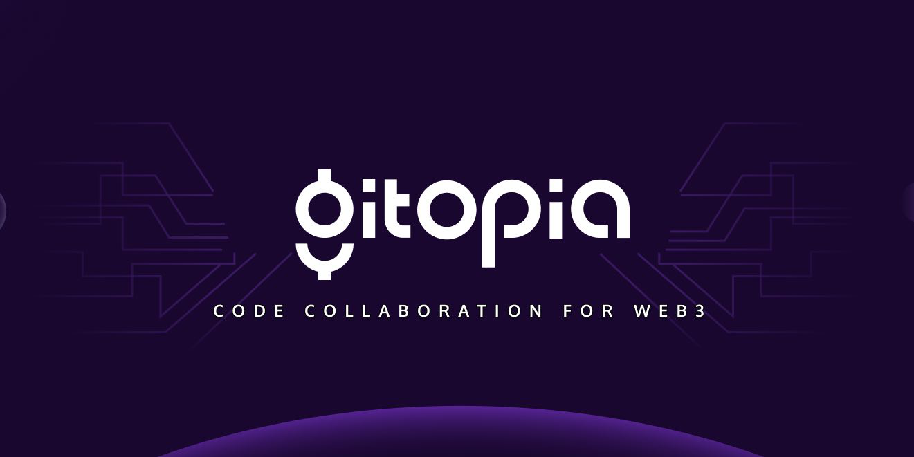

# Gitopia

<figure><figcaption></figcaption></figure>

[Discord](https://discord.gg/AfNgVRyy) | [Web-site](https://gitopia.com/home) | [Explorer](https://gitopia.exploreme.pro/validators) | [Documentation](https://docs.gitopia.com/)

### About project 

Gitopia is a next-generation code collaboration platform based on a decentralized network and an interactive token economy. It is designed to streamline the open source software development process through collaboration, transparency, and incentives.\
It's basically GitHub, only on the blockchain and with its own token.

### Rewards 

The reward pool of 3,250,000 LORE tokens will be divided into three main categories:\
Validators - 1,000,000 LORE tokens have been reserved for distribution via reward and distribution (delegating) to validators participating in the Janus Testnet.

\
Contribution rewards - 1,250,000 LORE tokens have been reserved for this activity. This event is designed to encourage significant contributions to Gitopia.

\
Community giveaway - A giveaway of 1,000,000 LORE tokens is planned for developers and members of the web3 and opensource communities. An airdrop will only be approved after the proposal has been thoroughly discussed and accepted by the community.

Also, the Janus testnet will announce several contests for validators, developers, and other ecosystem participants. These contests will allow community members to receive additional rewards for their contributions other than those mentioned above.

###
