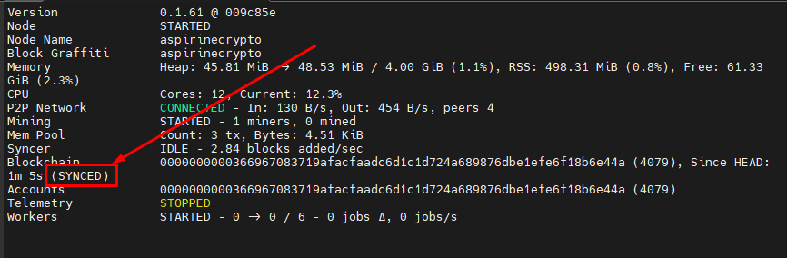

# Installation

_**Node**_

```bash
# Update the repositories
sudo apt update
```

```bash
# Install developer packages
sudo apt install curl make clang pkg-config libssl-dev build-essential git jq mc bc screen ufw -y
```

```bash
# Open port
sudo ufw allow 9033/tcp
```

```bash
# Install NodeJS
curl -fsSL https://deb.nodesource.com/setup_lts.x | sudo -E bash -
sudo apt-get install -y nodejs
```

```bash
# Install Yarn
sudo npm install -g yarn
```

```bash
# Install Rust
sudo curl https://sh.rustup.rs -sSf | sh -s -- -y
source $HOME/.cargo/env
```

```bash
# Install IronFish
sudo npm install -g ironfish
```

```bash
# Set the variables
IRONFISH_NODENAME=your graffiti,from registration
echo "export IRONFISH_WALLET="${IRONFISH_NODENAME}"" >> $HOME/.bash_profile
echo "export IRONFISH_NODENAME="${IRONFISH_NODENAME}"" >> $HOME/.bash_profile
source $HOME/.bash_profile
```

```bash
# Set name of node
ironfish config:set nodeName $IRONFISH_NODENAME
ironfish config:set blockGraffiti $IRONFISH_NODENAME
```

```bash
# Enable telemetry
ironfish config:set enableTelemetry true
```

```bash
# Create service file (One command)
sudo tee /etc/systemd/system/ironfishd.service > /dev/null <<EOF
[Unit]
Description=ironfishd node
After=network-online.target

[Service]
User=$USER
ExecStart=/usr/bin/ironfish start
Restart=always
RestartSec=600
RuntimeMaxSec=3600
LimitNOFILE=65535

[Install]
WantedBy=multi-user.target
EOF
```

```bash
# Start the node
sudo systemctl daemon-reload && \
sudo systemctl enable ironfishd && \
sudo systemctl restart ironfishd
```

```bash
# Check logs
sudo journalctl -f -u ironfishd

# Escape from logs ctrl+c
```

```bash
# Check status
ironfish status -f

Escape from logs ctrl+c
```

_**Wait for synchronization, should be like this:**_

<figure><figcaption></figcaption></figure>
