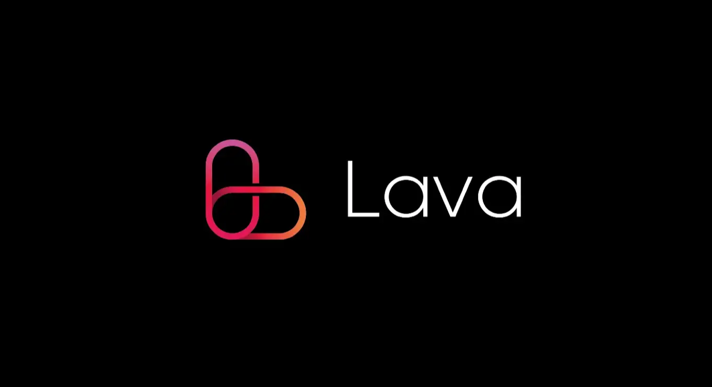

# Lava Network

<figure><figcaption></figcaption></figure>

[Сайт](https://www.lavanet.xyz/) | [GitHub](https://github.com/lavanet) | [Discord](https://discord.gg/lavanetxyz) | [Twitter](https://twitter.com/lavanetxyz) | [Docs](https://docs.lavanet.xyz/) | [Explorer](https://lava.exploreme.pro/validators)

Lava Network is a centralized RPC node dependency solution built on top of Cosmos and Tendermint. Lava Network creates a decentralized infrastructure layer for blockchain remote procedure calls, RPC - remote procedure calls. In essence, this is a peer-to-peer RPC network.

This solution will allow Web3 companies to eliminate dependence on centralized RPC nodes, which will reduce vulnerability and the likelihood of being compromised.

***
