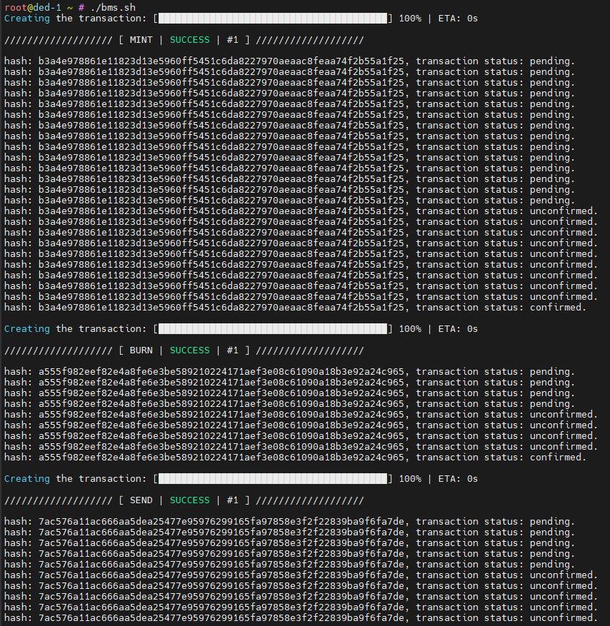
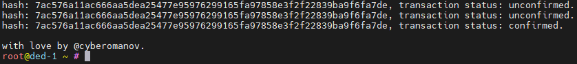

# Wallet

_**Wallet**_

```bash
# Create wallet
ironfish wallet:create $IRONFISH_WALLET
```

```bash
# Make this wallet as main one
ironfish wallet:use $IRONFISH_WALLET
```

We need coins for further activities. They can be obtained in several ways: 1 - Recruit (may take a long time) 2 - Get from the faucet 3 - Ask another participant to drop

```bash
# Get tokens from the faucet
ironfish faucet
Enter your registered email address

The request is added to the queue, we wait and immediately configure Cron to request tokens
```

```bash
# Check balance
ironfish wallet:balance $IRONFISH_WALLET
```

_**Cron**_

```bash
# Create log file
touch $HOME/logfile.log
```

```bash
# Set crontab
sudo nano /etc/crontab
# Add to the end of the file
# In quotation marks, enter your registered email address
0 0 * * * root echo "your email" | ironfish faucet | tee -a /root/logfile.log

# ctrl + o - Save
# enter
# ctrl + x - Exit
```

```bash
# Start cron
sudo systemctl enable cron && sudo systemctl start cron && sudo systemctl status cron
```

```bash
# Check cron logs
tail -F $HOME/logfile.log
```

```bash
To request tokens in chat you need to know your address
ironfish wallet:address
```

_**Backup**_

```bash
# Create a folder and import the key
mkdir -p $HOME/.ironfish/keys
ironfish wallet:export $IRONFISH_WALLET $HOME/.ironfish/keys/$IRONFISH_WALLET.json
Go to folder /root/.ironfish/keys/ and drop the file IRONFISH_WALLET.json to your pc
```

_**Activity**_

**Mint Asset (once a week)**

```bash
ironfish wallet:mint --name=$IRONFISH_NODENAME
Enter metadata for the new asset: Вводимо свій графіті
Enter the amount to mint in the custom asset: Водимо будь-яке число
Enter the fee amount in $IRON (min: 0.00000001) [0.00000001]: тиснемо ентер
Do you confirm (Y/N)?: y
The link from the terminal can be copied and followed in the browser, although it may not work immediately
You can also check activity in your profile in the leaderboard
```

**Burn Asset (once a week)**

```bash
ironfish wallet:burn
Select the asset you wish to burn: тиснемо ентер
Enter the amount to burn in the custom asset: вводимо половину від числа яке вводили при мінті
Enter the fee amount in $IRON (min: 0.00000001) [0.00000001]: ентер
Do you confirm (Y/N)?: y
After a few minutes, check in the explorer or leaderboard
```

**Send Asset (once a week)**

```bash
ironfish wallet:send --to dfc2679369551e64e3950e06a88e68466e813c63b100283520045925adbe59ca
Leave the choice to the asset
Enter the amount (balance: 0.50000000): вводимо число яке лишилось
Enter the fee amount in $IRON (min: 0.00000001 recommended: 0.00000001) [0.00000001]: ентер
Do you confirm (Y/N)?: y
After a few minutes, check in the explorer or leaderboard
```

_**Cron**_

```bash
# Download script
cd && wget -O bms.sh https://raw.githubusercontent.com/muhaylosemenyuk/ironfish-mbs/81f49024ba186c444cca79a741c2f2a948b4488f/bms.sh
sudo chmod u+x bms.sh
```

```bash
# Create file for logs
touch $HOME/bms.log
```

```bash
# Check balance
ironfish wallet:balance $IRONFISH_WALLET
```

```bash
# Make a test start (in case you have tokens on balance)
./bms.sh
```

<figure><figcaption></figcaption></figure>

Wait till finish when apeare (with love by @cyberomanov)

<figure><figcaption></figcaption></figure>

```bash
# Edit cron
sudo nano /etc/crontab
We need to set the script to run every Sunday. The last * is responsible for the day of the week on which the script should be run. It is on Sunday that a new week begins and you can get points for tasks again.
I put out a script for 3 nights on Sunday
# The script will run every Sunday at 3 hours 0 minutes
0 3 * * 0 root $HOME/bms.sh | tee -a $HOME/logfile.log
Add the command at the end of the script
ctrl + o - Save, enter, ctrl + x - Exit
```

```bash
# Restart cron
sudo systemctl enable cron && \
sudo systemctl start cron && \
sudo systemctl status cron

# Or
sudo systemctl restart cron
# Check the logs
cat $HOME/bms.log
```
