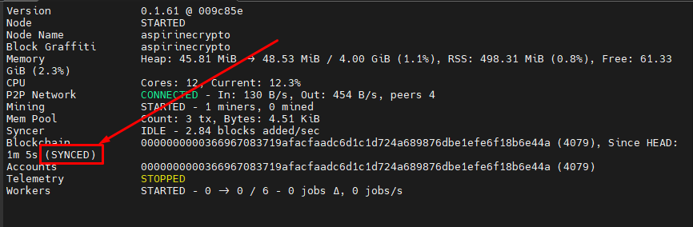

# Sui

<figure><figcaption></figcaption></figure>

Sui is a decentralized smart contract platform with high throughput and low latency. It uses the Move programming language to define assets as objects that an address can own. Programs define operations on these typed objects, including custom rules for creating them, transferring these assets to new owners, and operations that modify them. The network is supported by nodes that anyone can run. The $SUI token will be used to pay fees and staking.
